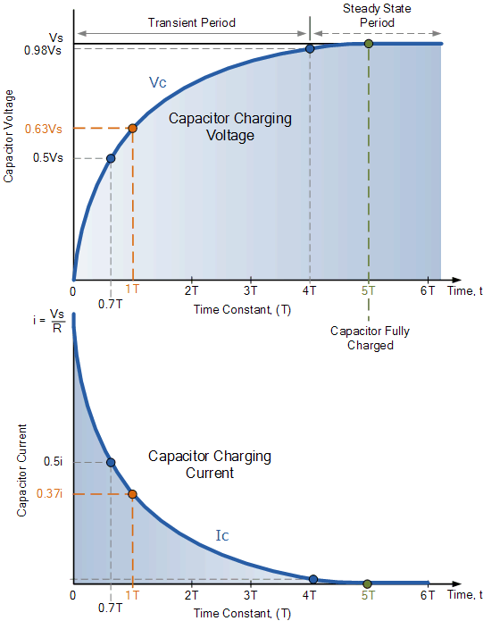

# Analysis of Campbell's design
## Signal frequency
The clock-signal period is approximately 3.55ms which equates to a frequency of 281.7Hz. With five vanes this means that the rotor rotates at 56.3Hz. Since the motor runs off the mains this number should probably be 60Hz.

With the motor at 60Hz and five vanes, the signal frequency is 300Hz.

## Input stage
Campbell has named the input configuration a transconductance amplifier but a similar design is named transimpedance amplifier in a [Wikipedia article](https://en.wikipedia.org/wiki/Transimpedance_amplifier) on the subject.

### 1Meg setting
LowPass filtered with corner frequency (half-power point) at 992Hz. The roll off is 20db/decade.
Output 0.957 V/μA ∠-16.8° @ 300Hz

### 100k setting
LowPass filtered with corner frequency at 1588Hz. The roll off is 20db/decade.
Output 0.983 V/10μA ∠-10.7° @ 300Hz

## AC Amplifier
### LowPass filtered amplifier one stage
* Input signal: 1mV amplitude @ 300Hz
* Output swing: 16.92mV to -33.72mV
* Output amplitude = 25,32mV
* DC level = -8,4mV
* Gain 25.316 (28.07dB) ∠-170.4° @ 300Hz
* Max gain 28.19 @ 380Hz
* Corner freq 1175Hz. Roll off 20dB/decade

### LowPass filtered amplifier two stages
* Input signal: 1mV amplitude @ 300Hz
* Output swing: 632,5mV to -649,3mV
* Output amplitude = 640,9mV
* DC level = -8,4mV
* Gain 25.316 (28.07dB) ∠-170.4° @ 300Hz pr stage
* Gain 640.9 (56.14dB) ∠19.2° @ 300Hz total
* Max gain 659.2 (56,38dB @ 380Hz)
* Corner freq 847Hz. Roll off 40dB/decade

## RC Low pass filter
RC Low pass filter between rectifier and calibration amplifier
* Input signal: 1V amplitude @ 300Hz
* Output swing: 639.5mV to 629.4mV 1000ms after power up
* Output ripple amplitude = 5,05mV (10.1mV p-p) @ 600Hz
* DC level = 634.45mV  (RMS=0.707*Vp Avg=0.637*Vp)
* Corner freq 7.2Hz. Roll off 20dB/decade

### Capacitor charging in the filter
* Time Constant = R*C = 22k * 1u = 22ms
* 5T = 110ms
* DC level  @ 110ms = (635.12mV + 624.87mV) / 2 = 630,00mV
* 99.3% of 634.45mV = 630,01mV

  
([Graphic](https://www.electronics-tutorials.ws/rc/rc_1.html) by [Electronics Tutorials](www.electronics-tutorials.ws))

| Time Constant       | Voltage  |
|---------------------|----------|
| 0.5 time constant   | 39.3%    |
| 0.7 time constant   | 50.3%    |
| 1.0 time constant   | 63.2%    |
| 2.0 time constants  | 86.5%    |
| 3.0 time constants  | 95.0%    |
| 4.0 time constants  | 98.2%    |
| 5.0 time constants  | 99.3%    |

## Calibration amplifier
Amplifier with gain from 1 to 2 (0dB to 6dB) to calibrate output. Nominal calibration is 1 V / (kV/m) with 1 Meg input setting.

## System transfer function
We assume that calibration gain is set at mid-range - equal to 1.5 (3.52dB).

### Antenna current amplitude 1.713nA / (kV/m)
* Out: _1.713nA @ 300Hz_ 

### Input stage
Output 0.957 V/μA ∠-16.8° @ 300Hz
* In: _1.713nA_
* Out: _1.64 mVp_

### AC Amplifier stage
* Gain 640.9 (56.14dB) ∠19.2° @ 300Hz total
* In: _1.64 mVp_
* Out: _1,05Vp_

### Rectifier with low pass filter
* Input signal: 1V amplitude @ 300Hz
* Output swing: 639.5mV to 629.4mV 1000ms after power up
* DC level = 634.45mV  (RMS=0.707*Vp Avg=0.637*Vp)
* In: _1,05Vp_
* Out: _0,66 VDC_

### Calibration stage
* Gain 1.5 (3.52dB) @ DC
* In: _0,66 VDC_
* Out: _0,997VDC_ (ripple .952 to 1.042 @ 600Hz)

### Entire System
* In: _1.713nA_
* Out: _1Vp_
1.00V / (kV/m)

The rectifier used in the simulation is probably more effective than the one used in Campbell's design. Based on this we can assume a value closer to 2nA / (kV/m) on his electric field antenna.
