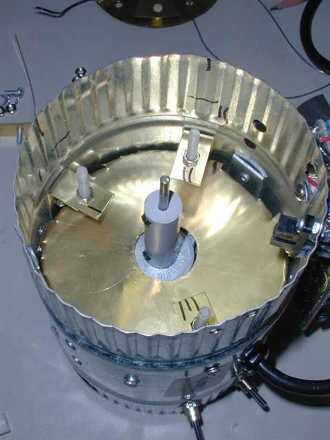

# Electric Field Mill Fabrication
This page describes the construction of an electric field mill. This is a device to measure the electric field strength on earth due to the static electric field and the charge of clouds passing overhead. It can also be used to investigate static electricity effects. The body and chopper of the field mill are fabricated from a 4 inch diameter duct fan. The signal conditioning electronics uses a chopper blade position detector and a synchronous detector to reduce noise and recover the field sign (positive or negative) as well as magnitude (strength in V/m).  

## Theory of Operation 
The strength of the electric field could be measured, in principle, by placing a volt meter across plates placed some distance apart. However, because the meter will have some input impedance (10 Meg typically), any voltage induced on the plates will quickly drain away, and would not be useful for measuring the static field. To make measurements of the static field, the chopper technique is used. The chopper blade is arranged over the Sense Plate and rotated so that it periodically shields, and exposes the Sense Plate to the electric field. To properly do this, the Rotor must be grounded. The Sense Plate is grounded through a transconductance amplifier, which converts the Sense Plate's ground current to a voltage. As the Sense Plate is exposed to the Field, the field induces ground currents as it attracts or repels charge from the Sense Plate. As the plate is shielded from the field, the induced charge drains away. So the chopper induces an AC ground current which is proportional to electric field strength. 
This AC signal could then be rectified to drive a DC volt meter or be plotted on a scope. However, by doing this only the magnitude of the field, not the sign (positive of negative) would be measured. Also, any noise in the signal would also affect the output. The signal conditioning for this Field Mill uses a synchronous demodulation technique to preserve field sign information and reduce noise. 

It works like this: The blade position is measured using an LED and photo transistor. The Position Sensor clock signal is used to effectively amplify the AC signal from the Sense Plate amplifier by either +1 or -1, depending on Rotor blade position. This has the effect of synchronously rectifying the AC signal, preserving sign. This rectified signal is then low pass filtered to remove ripple. Alternatively, this circuit function can be thought of as the mixing of two identical frequencies, resulting in output with frequency content at DC, and twice the input frequency. The low pass filter then passes only the DC component. This line of thought will also show how noise at frequencies other that the position clock frequency are rejected. 

## Field Mill Fabrication Notes
### Chopper Blades
Get a 4 inch diameter duct fan with fan blades as shown. Remove the fan and break off every other fan blade. Flatten the remaining blades in a vise.  

### Housing
I cut a shield from brass and mounted it over the motor too shield the sensor from motor 60 Hz. I don't know how necessary this really was. 

### Sensor Plate Mounting Brackets
Cut 3 stripes of brass (about .5 x 2 inches), fold about in half and drill. Drill three holes so that the ledge is about 1.5 inches down from the top. Attach the plastic Sensor Plate hardware to the brackets and mount the brackets inside the housing as shown.  

### Motor Shaft
Drill a hole (the same size at the motor shaft.) clean through a piece of .5 inch diameter delrin. Drill and tap the set screws. Cut a piece of stock the same size as the shaft and mount as shown . Note: My goal was initially to insolate the chopper rotor, but then found grounding was required. So you may be able to fabricate the Mill without having to extend the shaft like this. I did have to cut the end off the motor shaft to fit the extender back far enough, and did end up with some wobble on the extended shaft You could move the whole motor forward as well if needed.  

### Sensor plate and Ground Plate
Lay the Chopper blades on a sheet of .015 thick brass. Trace the outline of the chopper plate using a scribe and cut it out using tin snipes. Drill the center and cut to size using a nibble tool. Scribe a circle on a piece of brass and cut it out. Flatten both pieces (use a tap hammer on a flat metal surface) and cut out the center hole. Tap the two pieces together and drill 5 holes around them as shown. Assemble the sensor plate/ground plate using plastic hardware and spacers. Transfer the position of the mounting bracket to the Ground Plate by placing a blob of pink finger nail polish (thanks Anne) on the end of each screw and gently setting the Ground Plate down on it centered. Let the polish dry and drill the three mounting holes in the Ground Plate.  

### Position Detector
Get a photo interrupter detector as shown at The Shack. Position it right at the edge of the Sense Plate (you may need to cut a corner off the Sense Plate. Mark it's position and remove the Rotor and Sense Plate Assembly. Drill the Position Detector mounting holes and nibble the center out. Also drill holes for the wires leading to the Sense Plate Assembly. Mount the Position Detector and reassemble the Sense Plate and Rotor. Adjust the Rotor Height so the blades don't hit in the Position Detector. Check it upside down also, as there is some end play in the motor shaft.  

### Rotor Ground
Cut a strip of brass and fold it and mount it as shown in the Top View . As we expected, grounding the Chopper Rotor proved to be necessary. When the Rotor is left floating, large static outputs could be generated by depositing charge on the Rotor. Grounding the Rotor eliminated this source of offset drift. 

### Final Assembly
Drill mounting holes for the circuit board and mount it. Drill hole for off/on switch and mount the Power Supply in the bottom as shown in the Bottom View . Attach the Ground Plate and Case Ground to the Circuit Board. Attach the Position detector using coax for the photo transistor output. Attach the Sense Plate using coax grounded at the Circuit Board. Test.  

## Circuit Description and Notes 

### Power Supply
The circuit operates from a split supply (both +8 V and -8 V). I used a 12 DC wall transformer, a 7808 three pin regulator for the positive supply, and an ICL7660 voltage converter to generate the negative supply (or a Linear Tech LT1044 will work, and it is available in a DIP package from Digikey). You could also just use a transformer with a center tap an build a positive and negative supply. 

### Transconductance Amplifier
I used the AD795 as inherited from Shawn Carlson's article, but really any amp should work since input leakage induced offsets are blocked by the AC input to the next stage. I also placed two gain resisters, selectable with a header shorting bar. The 1 Meg value should give about 6 kV/m output range, which should be enough for cloud charge measurement. The 100 k value gives about a 60 kV/m output range, and is a better range for static charge investigation (like measuring the cat). The feedback capacitor values provided a high pass roll off about 1 kHz. Note: The ICL7660 switches at around 10 kHz, so rolling off the amplifiers is recommended. The shield around the first amplifier is also necessary to protect against noise from the position detector. 

### AC Amplifier Stage
I partitioned the gain into 2 stages of 30 to get an overall voltage gain of about 1000. This could be done with a single amplifier, but input offset specifications should be looked into to avoid a large output offset. The AC coupling corner frequency for each is about 150 Hz, and both amplifiers are also rolled off at around 1 kHz. 

### Position Detector Clock Generator
The photo transistor is setup to switch between the positive and negative supply voltages. This is the level required to control the 14066 quad analog switch. One of the anolog switch stages is setup as an inverter to generate a complimentary clock.  

### Synchronous Demodulator
The output of the AC amplifier is connected to an inverter stage. Two analog switches are used to alternately apply the inverted, and non-inverted output to the input of the low pass filter. The low pass filter is configured with a corner frequency of 7 Hz. 

### Calibration Amplifier
The output of the low pass filter is applied to a non-inverting DC amplifier with an adjustable resister in the feed back for calibration. Calibrate the instrument by placing a sheet of metal 10 cm above the Ground Plate. Put an adjustable power supply across this plate and the housing ground. Change this applied voltage from 0 V to 20V (200 V/m field strength) and note output voltage change. Adjust the resistor until this produces 200 mV of change (using the 1 Meg resister setting on the first amplifier). The output voltage sensitivity will then be 1 V / (kV/m). Note: There will be some level of background field while you do this, so be sure to note the CHANGE in output while changing the applied field.

## Circuit Board Fabrication Notes 
Fabricate the Circuit board as shown. Pay careful attention to grounding and power distribution. Using terminal blocks is most helpful during trouble-shooting. It may be helpful to reposition the Position Detector terminal block further away from the Sense Plate input terminal block for reasons discussed below.  
  

**Note**: Since this circuit has a very sensitive input stage, and uses synchronous demodulation , it becomes very sensitive to noise generated by the position detector. The shield around the first amplifier, and the coax shield on the wire going to the sense plate are mostly necessary to prevent coupling of the Position Detector clock signal into the amplifier. I also placed the photo transistor end of the Photo Detector on top, furthest from the Sense Plate. The Rotor may also provide some level of shielding as well. Although there is still some low level of coupling, these steps brought it under control (<50mV at ac output). Perhaps I could try wrapping some copper tape around the photo transistor and grounding it. You can characterize the level of coupling by observing the AC output signal while disconnecting the photo transistor at the terminal block. Before adding the shielding and coax, this test showed several volts at the AC output!  

## References
### Web References
1. ~~[Scientific American Amateur Scientist Field Mill Project](http://www.sciam.com/1999/0799issue/0799amsci.html)~~
2. ~~[Scientific American Amateur Scientist Field Mill Project Discussion](http://web2.thesphere.com/SAS/WebX.cgi?128@^1658496@.ee6c3fd/0)~~
3. [Lightning Detectors](http://www.techlib.com/electronics/lightning.html)
4. ~~[NASA/Marshall Space Flight Center Airborne Electric Field Mill](http://www.tstorm.com/lplws.html)~~
5. ~~[GP-1 Lightning Locator](http://bub2.meteo.psu.edu/default.htm)~~
6. [University of Florida Lightning Research Group](http://www.lightning.ece.ufl.edu/)
7. ~~[Experimental E-Field Data](http://weather.ou.edu/~fgallag/efield/index.shtml)~~
8. ~~[Global Atmospherics, Inc.](http://www.glatmos.com/products/local/efm.html)~~
9. ~~[Atmospheric Electricity HomePage](http://ae.nsstc.uah.edu/)~~
10. [The Earth's Electrical Environment - E.P. Kreider 1986](http://www.nap.edu/books/0309036801/html/30.html)
11. ~~[Development of a Lightning Warning System -- Adam Milner](http://bat.nmt.edu/milner/milner.html)~~
12. ~~[Near-real time lightning tracking: Global Atmospherics, Inc. ](http://www.lightningstorm.com/lightningstorm/gpg/lex1/mapdisplay_free.jsp)~~
13. ~~[Intellicast Lighting](http://www.intellicast.com/LocalWeather/World/UnitedStates/NationalLightning/)~~
14. ~~[Lightning strike triggered by a flying airplane](http://lightning.pwr.eng.osaka-u.ac.jp/lrg/temp/plane.html)~~
15. ~~[Lightningtalks.com](http://www.lightningtalks.com/)~~

### Print References
1. Martin A. Uman - Lightning, McGraw-Hill Book Company, New York (1969), 264 pages. Russian translation (1972), revised edition, Dover, New York (1984). (Available at Borders)

_James A. Campbell  
Copyright © 2001  
All Rights Reserved_
